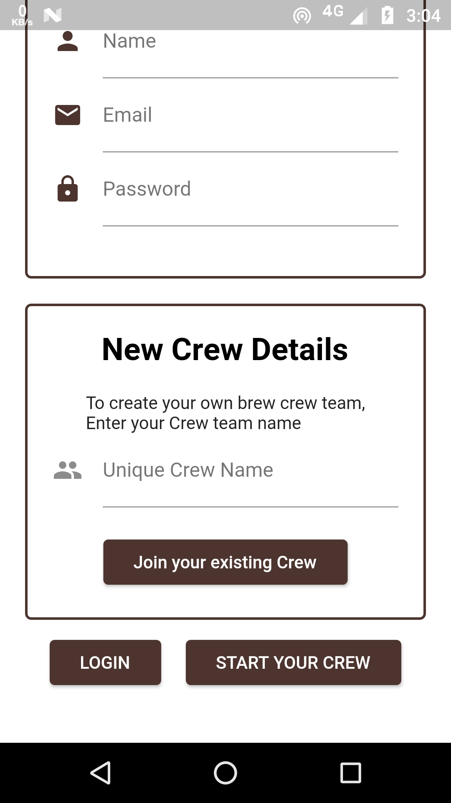

# Brew Crew Cafe

A Very Special App for all Coffee Enthusiast's who loves their Coffee Preferences and always want customization at top priority. Here is the app which speaks your love towards coffee and your preference. It's made for you and your crew members to get the perfect coffee of your type to meet your delicious coffee desire.

For Quick Starters Register yourself by creating your own new crews and share your crew id with your friends and colleagues, Add up your coffee preference and you are ready to go. Your Taste and Your preference for coffee are shared among your crew, So you will always be getting the perfect coffee you want.

## Getting Started


 <a href="https://play.google.com/store/apps/details?id=com.akshaybengani.brewcrewcafe"> <b>Download Now</b></a>

<br>
<br>
<br>
<br>

Brew Crew Cafe is a Flutter Application developed by Akshay Bengani as a self learning project.

```
I am quite bad with HTML Layout formatting I wish I could design readme in dart.
Contributions for README Alignment is greately Appreciated.
```

## Features
*   User Authentication via Firebase Authentication
*   Cloud Storage via Firebase Realtime Database
*   Unique Id Generator for users using ShortID Package
*   Local and Cloud Database Sync System for being updated with changes.
*   Persitent Storage via Sqflite for offline accessibility
*   Creative User interface

## Screen Shots


<br>


<br>


<br>


<br>

## Level 1 Flow Chart Explaining Basic Navigation

<br>

## Level 2 Flow Chart Explaining Functions


## Screen Wireframes


## Database Structure
Database consist of Three nodes
*   CrewDetails
*   Crews
*   UserDetails
### CrewDetails
It consist information of crew id crewadmin and crewname.
1. When new user registers himself with crewid in that case we dont have crewname and for creating user node in crews node we need crewname as such I created a node which contains the crewname.
2. When a user go to support section and request for help he need to get the crewadmin name and contact and for getting another user details we need his/her authid registered as admin of that particular crew, so this crewadmin contains the authid of the admin user created at the time of New Crew Resgistration.

### UserDetails
*   This node contains two values with parent as authid of the user.
1. When user signIn in app he dont have crewid and to fetch data of crew members we need crewid, as such this node supply crewid using authid we get during signin.
2. When user is admin and he needs to delete the whole crew the security system checks that if the crewid and admin status inside crewdetails node is correct then proceed the deletion process, Since the admin flag is also mentioned in the usernode of crews but still for verification we need both the values from different place.

### Crews
* Crews is the main node which consist of all users information and crewdetails for every crew there is a seperate node and in each node all the users are listed with a new node forming as authid and thier data is provided using crewid and authid.
*   The values of a user contains crewadmin which is used to handle offline work with app drawer to check weather the user is admin or not to display manage users or support screen.

